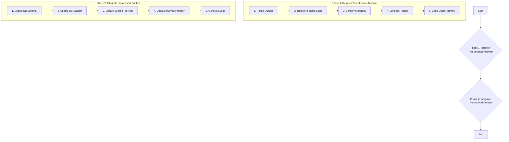

# Refactoring Plan: TreeStructureAnalyzer and Context Enhancement (Detailed)

This document outlines the detailed plan for refactoring `treeStructureAnalyzer.ts` to improve structure and comment identification, and subsequently integrating this enhanced structural information into the analysis context provided to the language model.

## Phase 1: Refactor `treeStructureAnalyzer.ts`

*   **Goal:** Improve comment association, simplify implementation using only Tree-sitter queries, remove regex dependencies for structure finding, and enhance testing.
*   **Checklist & Detailed Steps:**
    *   **1. Refine Tree-sitter Queries:**
        *   [ ] Iterate through each language in `languageConfigs`.
        *   [ ] For `functionQueries`, `classQueries`, `methodQueries`:
            *   [ ] Ensure the pattern `((comment)+ @comment . (decorator_or_attribute)* . (structure_node) @structure_capture_name) @capture` is consistently used or adapted.
            *   [ ] Verify capture names (`@comment`, `@structure_capture_name`, `@capture`) are consistent and correctly target comments, the main node, and the overall range including comments/decorators.
            *   [ ] Test queries with examples containing various comment styles, decorators/attributes, and different declaration styles (e.g., export, assignment).
            *   [ ] Specifically review and correct C++ method queries for accuracy within class/struct bodies.
        *   [ ] Remove the top-level `commentQueries` list from `languageConfigs`, as comments should now be captured directly with their associated structures. Retain capability to query for standalone comments later.
    *   **2. Refactor Structure Finding Logic:**
        *   [ ] In `findFunctions` / `findClasses`:
            *   [ ] Remove any regex-based fallback logic for structure or comment identification.
            *   [ ] Modify the loop processing `query.matches(rootNode)` results.
            *   [ ] Reliably extract `commentNode`, `structureNode`, and `captureNode` from `match.captures` based on refined query capture names.
            *   [ ] Calculate `range` using `captureNode` (preferred) or `structureNode`.
            *   [ ] Calculate `contentRange` strictly from `structureNode`.
            *   [ ] Extract and clean `commentText` using `commentNode` and `cleanCommentText`.
            *   [ ] Extract `structureText` using `captureNode` or `structureNode`.
            *   [ ] Improve `parentContext` determination (e.g., check `structureNode.parent` type, use range checks against previously found containers).
            *   [ ] Implement C++ trailing namespace comment logic: After processing a `namespace_definition` node, check text on the same line after `node.endIndex` for `// namespace foo` pattern. Store in `trailingComment` and append to `structureText`.
        *   [ ] In `findAllStructures`:
            *   [ ] Call the refactored `findFunctions` and `findClasses`.
            *   [ ] Implement reliable `file_header_comment` detection (e.g., check the first `comment` node in the tree if it starts at row 0, column 0).
            *   [ ] Implement `standalone_comment` detection: Run a simple `(comment) @comment` query. Filter out comments already associated with structures by checking range overlap (comment range should not overlap structure's `contentRange` but might be adjacent to `range`).
            *   [ ] Combine results (classes, functions, header, standalone).
            *   [ ] Review and refine forward declaration filtering logic.
            *   [ ] Call `buildStructureHierarchy`.
            *   [ ] Call `assignStructureIds`.
    *   **3. Simplify Hierarchy Building (`buildStructureHierarchy`):**
        *   [ ] Re-evaluate the current sorting and multi-pass approach.
        *   [ ] Consider a simpler approach: After `findAllStructures` creates a flat list, iterate through it. For each structure, use its `parentContext` (if found by queries) or find the smallest containing structure based on `range` containment to assign `parent` and add to `parent.children`. Ensure robustness against cycles.
    *   **4. Enhance Testing:**
        *   [ ] **`treeStructureAnalyzerComments.test.ts`:** Add specific `it(...)` blocks testing:
            *   C++ namespace, struct, enum with preceding comments.
            *   C++ namespace with trailing `// namespace foo` comment.
            *   Comments separated by blank lines before a structure.
            *   Comments with decorators/attributes between them and the structure.
            *   Different comment styles (`//`, `/* */`, `/** */`) preceding structures.
            *   Methods within classes/structs with preceding comments.
        *   [ ] **`complexCppSample.test.ts`:**
            *   [ ] Create file `src/__tests__/complexCppSample.test.ts`.
            *   [ ] Load `complex_cpp_sample.cpp` fixture.
            *   [ ] Call `analyzer.findAllStructures` or `getStructureHierarchy`.
            *   [ ] Add specific `expect` assertions verifying:
                *   Correct identification and comment association for all major structures (file header, namespaces, classes, functions, templates, structs, enums, methods).
                *   Correct identification of trailing comments for namespaces (`utils`, `utils::strings`).
                *   Accurate parent-child relationships (e.g., `Helper` is child of `utils`).
    *   **5. Code Quality Review:**
        *   [ ] Search `treeStructureAnalyzer.ts` for any remaining regex used for structure finding and remove them.
        *   [ ] Review refactored functions for clarity, adherence to SOLID/DRY principles, and potential duplication.

## Phase 2: Integrate Hierarchical Context into Analysis

*   **Goal:** Store and utilize the structural hierarchy information in the analysis workflow to provide richer context to the LLM. *(To be implemented in a subsequent session).*
*   **Checklist & Detailed Steps:**
    *   **1. Update Database Schema (`vectorDatabaseService.ts`):**
        *   [ ] Modify `initializeSchema`: Add columns to the `chunks` table (e.g., `parent_chunk_id TEXT NULLABLE`, `hierarchy_level INTEGER`, `full_path TEXT`). Consider adding relevant indexes.
    *   **2. Update Database Adapter (`embeddingDatabaseAdapter.ts`):**
        *   [ ] Modify `storeChunks`: Accept new hierarchy data (parent ID, level, path) and pass it to `vectorDatabaseService.storeChunks`.
        *   [ ] Modify `findRelevantCodeContext`: After retrieving initial results, potentially query the database using the new hierarchy columns to fetch parent/contextual chunks. Update `SimilaritySearchResult` type if needed to carry hierarchy info.
    *   **3. Update Context Provider (`contextProvider.ts`):**
        *   [ ] Modify `formatContextResults`: Retrieve hierarchy information for each result (from the updated `SimilaritySearchResult` or via the adapter). Include this hierarchy path (e.g., `Namespace::Class::Function`) in the formatted output for each context snippet.
        *   [ ] Review `extractMeaningfulChunks` to potentially leverage hierarchy.
    *   **4. Update Analysis Provider (`analysisProvider.ts`):**
        *   [ ] Modify `getSystemPromptForMode`: Add instructions for the LLM explaining the structural context provided (e.g., "Context snippets are annotated with their structural path...").
        *   [ ] Ensure the final prompt construction correctly includes the hierarchy-enhanced context.
    *   **5. Generate Documentation:**
        *   [ ] Create `docs/structure_aware_context.md`.
        *   [ ] Document the database schema changes for hierarchy.
        *   [ ] Explain how `embeddingDatabaseAdapter` and `contextProvider` store and use this data.
        *   [ ] Provide an example of the enhanced context format presented to the LLM.
