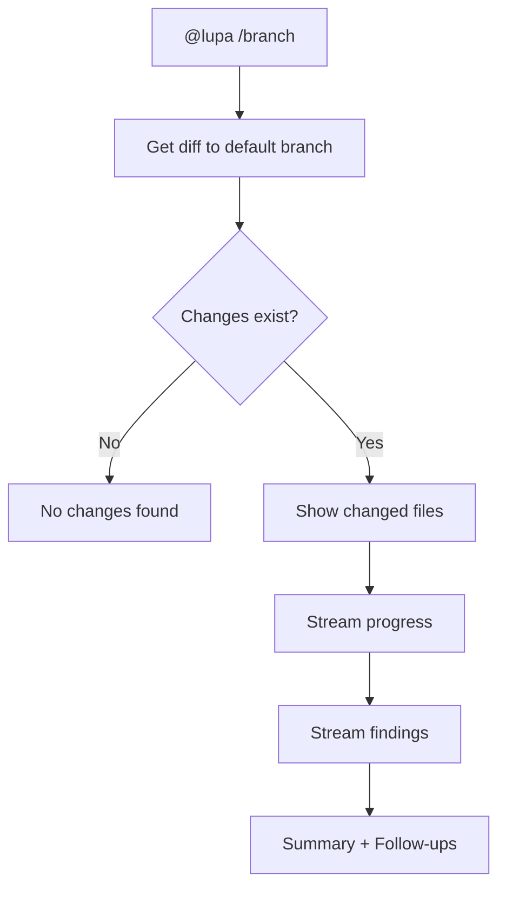
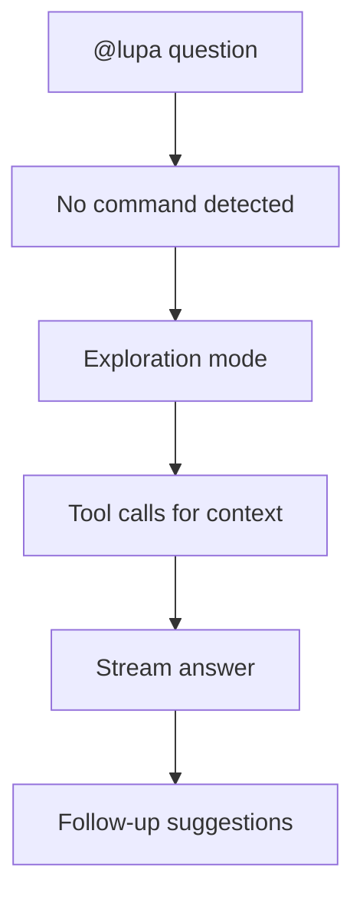

# UX Design Specification: @lupa Chat Participant

**Author:** Igor
**Date:** December 15, 2025
**Version:** 1.0
**Status:** IN PROGRESS

---

## Executive Summary

### Project Vision

Transform Lupa from a standalone VS Code extension into a **conversational code review companion** that lives natively in GitHub Copilot Chat. Users invoke `@lupa /branch` or `@lupa /changes` to receive streaming, interactive analysis with follow-up capabilities—eliminating the 4-step command palette flow in favor of natural language interaction.

### Target Users

**Primary Persona: The Conscientious Developer**

- Uses VS Code with GitHub Copilot daily
- Experiences "code review anxiety" before pushing changes
- Values quick feedback over comprehensive reports
- Wants confidence, not criticism
- Time-pressed, prefers conversational interaction over navigating UIs

**User Context:**

- Technical skill: Expert (power users of modern dev tools)
- Devices: Desktop (VS Code only, no mobile considerations)
- Usage pattern: Before commits, before PRs, during exploration

### Key Design Challenges

1. **Conversational Anxiety Management**
   The chat must feel supportive, not judgmental. Findings presented as helpful suggestions from a wise colleague, not criticisms from an automated linter.

2. **Streaming State Communication**
   Analysis takes 1-5 minutes. Users need: progress visibility (what's happening now), control (can I cancel), and partial value (show findings as they arrive).

3. **Information Hierarchy in Linear Medium**
   Chat is a stream, not a dashboard. Must design for: quick visual scanning via severity indicators, clickable references without clutter, and progressive disclosure.

### Design Opportunities

1. **Conversational Follow-ups**
   Unlike static reports, chat enables iterative refinement: "Focus on security", "Explain this risk", "What tests should I add?" This is a major UX advantage.

2. **Trust Through Transparency**
   Show the "how" of analysis: files examined, symbols traced, reasoning paths. Builds user confidence in AI recommendations.

3. **Ambient Integration**
   Living in Copilot Chat means Lupa is always one `@` away. Reduces activation energy compared to command palette navigation.

---

## Core User Experience

### Defining Experience

**Core Action:** Invoke analysis and trust the response.

The fundamental user experience is a **single chat message** (`@lupa /branch` or `@lupa /changes`) that returns **streaming, actionable insights** about code changes. Unlike traditional static analysis tools, this is a conversation – users can ask follow-ups, request deeper analysis, or pivot to new questions.

**Core Loop:**

1. User types `@lupa /branch` (or `/changes`)
2. Lupa acknowledges immediately with progress
3. Findings stream in with visual severity indicators
4. User clicks to navigate, asks follow-ups, or accepts the analysis
5. User pushes code with confidence

### Platform Strategy

**Platform:** VS Code Desktop (Copilot Chat integration)
**Input:** Keyboard + mouse (no touch considerations)
**Output Medium:** Copilot Chat response stream
**Rendering:** VS Code markdown with enhanced elements

**Available UI Elements:**

| Element    | Method               | Usage                    |
| ---------- | -------------------- | ------------------------ |
| Progress   | `stream.progress()`  | Analysis status updates  |
| Content    | `stream.markdown()`  | Findings, explanations   |
| File Links | `stream.anchor()`    | Clickable code locations |
| File Icons | `stream.reference()` | File context indicators  |
| Actions    | `stream.button()`    | "Open in Webview", etc.  |
| Tree View  | `stream.filetree()`  | Changed files structure  |

**Platform Constraints:**

- No persistent UI (everything in chat stream)
- Linear information flow (no tabs, sidebars)
- Markdown rendering limitations
- Session-based history (not persisted across restarts)

### Effortless Interactions

**Must Be Effortless:**

1. **Command Invocation**

   - `@lupa /branch` or `@lupa /changes` – no other setup required
   - Auto-completion for commands
   - No configuration needed for first use

2. **Severity Recognition**

   - 🔴 Critical, 🟡 Suggestion visible instantly
   - No paragraph reading to assess priority
   - Color + emoji for accessibility

3. **Code Navigation**

   - Every file reference is a clickable anchor
   - Click → opens file at exact line
   - No manual searching for problem locations

4. **Follow-up Actions**

   - Suggested follow-ups appear after analysis
   - One click to drill deeper
   - Context preserved across turns

5. **Graceful Exit**
   - Cancel button works instantly
   - Partial results preserved
   - Clear "Analysis cancelled" message

### Critical Success Moments

**Moment 1: "It's Alive!" (0-500ms)**
User types command, sees progress message immediately. Confirms Lupa is working.

**Moment 2: "This is Actually Useful" (First Finding)**
First real issue appears with clear explanation and clickable location. Validates the tool's intelligence.

**Moment 3: "I Almost Shipped That!" (Critical Issue Found)**
User discovers a real bug they would have missed. Creates the "I need this tool" realization.

**Moment 4: "It Gets Me" (Smart Follow-up)**
User asks "What tests should I add?" and receives genuinely contextual suggestions based on their actual changes.

**Moment 5: "That Was Easy" (Complete Flow)**
User goes from invocation to confidence in their code in under 5 minutes. Pushes with peace of mind.

### Experience Principles

1. **Instant Feedback**
   First progress signal within 500ms. Silence equals "broken" in user perception.

2. **Glanceable Severity**
   Critical issues identifiable in under 1 second via visual hierarchy (emoji + formatting).

3. **One-Click Navigation**
   Every file/line reference is immediately clickable and opens the correct location.

4. **Conversational Intelligence**
   Follow-up suggestions feel contextually aware, not templated or generic.

5. **Graceful Control**
   User can cancel anytime, partial results are preserved, no orphaned processes.

6. **Trust Through Transparency**
   Show what files are being analyzed, which symbols traced, why issues flagged.

---

## Desired Emotional Response

### Primary Emotional Goals

1. **Confidence**
   The dominant feeling should be "I can trust this analysis and push my code." Lupa exists to transform code review anxiety into proactive confidence.

2. **Relief**
   Developers carry cognitive load wondering "did I miss something?" Lupa should lift that burden. The experience should feel like exhaling after holding your breath.

3. **Trust**
   Users must believe the analysis is thorough. Not "Lupa said it's fine, but..." – rather, "Lupa checked it; I trust that."

4. **Partnership**
   Lupa should feel like a knowledgeable colleague reviewing your code, not a judgmental tool auditing your work.

### Emotional Journey Mapping

| Stage                | Before         | During        | Target Emotion        |
| -------------------- | -------------- | ------------- | --------------------- |
| **Invocation**       | Slight anxiety | Anticipation  | Proactive confidence  |
| **Progress**         | Uncertainty    | Engagement    | Informed patience     |
| **Results (issues)** | Concern        | Understanding | Empowered to act      |
| **Results (clean)**  | Hope           | Validation    | Relief and confidence |
| **Follow-up**        | Curiosity      | Discovery     | Mastery and control   |
| **Push code**        | Residual doubt | Resolution    | Peaceful confidence   |

### Micro-Emotions

**Critical Micro-Emotion Pairs:**

| Positive (Cultivate) | Negative (Avoid)  | Design Trigger                     |
| -------------------- | ----------------- | ---------------------------------- |
| Confidence           | Confusion         | Clear, jargon-free messages        |
| Trust                | Skepticism        | Visible reasoning and transparency |
| Accomplishment       | Frustration       | Interactions that work first time  |
| Competence           | Imposter Syndrome | Non-judgmental language            |
| Curiosity            | Overwhelm         | Progressive disclosure             |
| Gratitude            | Shame             | Supportive framing of issues       |

### Design Implications

**Tone Guidelines:**

| Scenario    | ❌ Don't Say                    | ✅ Do Say                                        |
| ----------- | ------------------------------- | ------------------------------------------------ |
| Issue found | "Error: Bad code detected"      | "Potential issue: Consider reviewing..."         |
| Severe bug  | "Critical mistake in your code" | "🔴 Important: This could cause..."              |
| No issues   | "No errors"                     | "✅ Looking good! No critical issues found."     |
| Cancelled   | "Aborted"                       | "Analysis paused. Here's what I found so far..." |

**Visual Emotional Cues:**

- 🟢 Green = confidence, success, all clear
- 🔴 Red = attention needed (not punishment)
- 🟡 Yellow = consider this (not warning/danger)
- 💭 Thinking = transparency, building trust
- ✅ Checkmarks = accomplishment, completion

### Emotional Design Principles

1. **Supportive, Not Judgmental**
   Every message should feel like feedback from a helpful colleague, not criticism from an automated system.

2. **Silence = Anxiety**
   Always show progress. Uncertainty is emotionally worse than bad news.

3. **Frame Issues as Catches, Not Failures**
   "Caught this before it shipped!" not "You wrote buggy code."

4. **Celebrate Success**
   When analysis finds nothing, don't just say "No issues." Say "Looking good! Ready to ship."

5. **Empowerment Over Information**
   Don't just report problems – provide paths to resolution. Link to fix, suggest tests, offer follow-ups.

6. **Transparency Builds Trust**
   Show the work: files analyzed, symbols traced, reasoning paths. Hidden analysis breeds skepticism.

---

## UX Pattern Analysis & Inspiration

### Inspiring Products Analysis

#### 1. GitHub Copilot Chat

**Platform Context:** The native environment where @lupa operates.

**Key Patterns to Leverage:**

- Streaming text responses (word-by-word, feels alive)
- Code blocks with syntax highlighting
- Clickable file references via `stream.anchor()`
- Follow-up suggestion chips via `stream.button()` pattern
- `@mention` autocomplete for participant invocation
- `/command` suggestions for quick actions

**Emotional Lesson:** The streaming pattern makes AI feel thoughtful, not robotic.

#### 2. ESLint/TypeScript Error Squiggles

**Mastery of Glanceable Severity**

**Key Patterns to Adapt:**

- Color = Severity (red/yellow/blue instantly readable)
- Hover for progressive detail disclosure
- Quick Fix actions with one click
- Problem counts in status bar ("2 errors, 5 warnings")

**Adaptation for Chat:** Can't do inline squiggles – use emoji severity (🔴🟡) with clickable anchors to achieve same glanceability.

#### 3. ChatGPT / Claude

**Conversational AI UX Standards**

**Key Patterns to Adopt:**

- "Thinking..." indicator builds trust during processing
- Markdown formatting for scannable structure
- Copy button on code blocks
- Clear turn boundaries in conversation

**Emotional Lesson:** "Thinking" indicators transform silence (anxiety-inducing) into visible activity (trust-building).

#### 4. Slack

**Chat UX Pioneering**

**Key Patterns to Adapt:**

- Rich unfurls for links (file references with icons)
- Clear message formatting hierarchy
- Action buttons for quick responses
- Visual polish that creates professional feel

### Transferable UX Patterns

#### Adopt Directly

| Pattern                 | Source       | Application                             |
| ----------------------- | ------------ | --------------------------------------- |
| Streaming text          | Copilot Chat | All responses stream word-by-word       |
| Emoji severity          | ESLint       | 🔴 Critical, 🟡 Suggestion              |
| Syntax-highlighted code | Universal    | All code blocks use language tags       |
| Follow-up chips         | Copilot Chat | Contextual next actions                 |
| Progress indicators     | ChatGPT      | Show "Reading files...", "Analyzing..." |

#### Adapt for Our Context

| Pattern                        | Adaptation                                         |
| ------------------------------ | -------------------------------------------------- |
| Error squiggles → Anchor links | Click emoji → opens file at problem line           |
| Quick Fix → Follow-up prompt   | "Show me how to fix this" suggestion               |
| File preview → Filetree        | `stream.filetree()` for changed files              |
| Thinking dot → Rich progress   | "Examining `AuthHandler` for security patterns..." |

### Anti-Patterns to Avoid

| Anti-Pattern             | Problem          | Alternative                           |
| ------------------------ | ---------------- | ------------------------------------- |
| Wall of text             | Users won't read | Bullet points, progressive disclosure |
| Silent processing        | Creates anxiety  | Always show progress                  |
| Generic follow-ups       | Feels robotic    | Context-aware suggestions             |
| Jargon-heavy language    | Alienates users  | Plain language explanations           |
| Too many severity levels | Decision fatigue | Only 2: Critical + Suggestion         |
| Aggressive error styling | Creates shame    | Supportive, constructive tone         |
| Information dump         | Overwhelming     | Summary first, details on demand      |

### Design Inspiration Strategy

**Guiding Principle:** We're not inventing new patterns – we're applying proven patterns to a new problem domain.

**Strategy Summary:**

1. **Match Platform Conventions** – Use Copilot Chat patterns users already know
2. **Adapt Developer Tool Patterns** – Bring ESLint-style glanceability to chat
3. **Learn from AI Conversation Masters** – Apply ChatGPT's trust-building patterns
4. **Avoid Common Pitfalls** – Silent processing, walls of text, generic responses

**Unique Opportunity:** Combine streaming AI response patterns (ChatGPT) with developer-specific feedback patterns (ESLint) in the chat context (Copilot). No existing tool does this well.

---

## Design System Foundation

### Design System Choice

**Primary Interface: VS Code Copilot Chat**
Design system = VS Code Chat API methods + Markdown conventions

**Secondary Interface: Webview (Existing)**
Design system = React 19 + shadcn/ui + Tailwind CSS v4 (already implemented)

This is a **constrained design context**. Unlike traditional web/mobile apps where we choose component libraries, the chat participant interface is defined by VS Code's streaming API. Our "design system" is therefore a **Markdown Style Guide** and **Stream Method Conventions**.

### Rationale for Selection

1. **No Custom UI Rendering in Chat**
   Copilot Chat renders markdown and API elements. We cannot inject custom CSS or React components.

2. **Leverage Platform Consistency**
   Users expect chat responses to look like other Copilot participants. Matching platform conventions reduces cognitive load.

3. **Existing Webview Investment**
   The command palette flow already has shadcn/ui + Tailwind. Reusing this for any webview needs maintains consistency.

4. **Focus on Content Design**
   Our differentiation is in _what_ we communicate and _how_ we structure it, not custom visual styling.

### Implementation Approach

#### Chat Output (Markdown + Stream API)

**Stream Method Usage:**

| Method                          | Usage Pattern                              |
| ------------------------------- | ------------------------------------------ |
| `stream.progress(message)`      | Status updates: "Reading changed files..." |
| `stream.markdown(content)`      | All formatted output including findings    |
| `stream.anchor(location, text)` | Clickable file:line references             |
| `stream.reference(uri)`         | File icons in file listings                |
| `stream.button(command, title)` | Action buttons like "Open Full Report"     |
| `stream.filetree(items)`        | Changed files tree visualization           |

**Markdown Formatting Conventions:**

```markdown
## Major Section Header

### Sub-Section Header

🔴 **Critical Issue Title** in [file.ts](file.ts#L42)
Description of the issue with context...

🟡 **Suggestion Title**
Recommendation with explanation...

✅ **Looking Good**
Positive reinforcement message...
```

#### Webview (Existing System)

- **Framework:** React 19 with React Compiler
- **Components:** shadcn/ui (already implemented)
- **Styling:** Tailwind CSS v4
- **Purpose:** Detailed analysis review from command palette flow

No changes needed – existing design system is appropriate.

### Customization Strategy

**What We Customize (Chat):**

1. **Severity Emoji System** – 🔴🟡✅💭 for glanceable status
2. **Section Structure** – Consistent heading hierarchy
3. **Progress Message Voice** – Active, descriptive, transparent
4. **Follow-up Chip Content** – Context-aware suggestions

**What We Don't Customize (Chat):**

- Colors (VS Code theme controls this)
- Fonts (VS Code theme controls this)
- Layout (linear chat stream is fixed)

**Markdown Style Guide:**

| Element       | Convention                                                              |
| ------------- | ----------------------------------------------------------------------- |
| Headers       | `##` for sections, `###` for issues                                     |
| Severity      | 🔴 Critical, 🟡 Suggestion, ✅ Success                                  |
| Code (inline) | Single backticks: \`symbolName\`                                        |
| Code (block)  | Triple backticks with language tag                                      |
| File refs     | `stream.anchor()` for line-specific, `stream.reference()` for file-only |
| Emphasis      | **Bold** for issue titles, _italic_ for notes                           |
| Lists         | Bullet for findings, numbered for steps                                 |

---

## Defining Core Experience

### The "One Thing"

**@lupa's Defining Experience:**

> "Ask about my code changes and get trustworthy, actionable feedback instantly – like having a senior developer review my code in 2 minutes."

This is what users will tell colleagues. This is what makes them come back. If we nail this one interaction, everything else follows.

### User Mental Model

**Current Problem-Solving Approaches:**

| Approach         | Pain Point                                 |
| ---------------- | ------------------------------------------ |
| Self-review diff | Tedious, easy to miss things               |
| Ask colleague    | Waiting, feeling guilty for interrupting   |
| CI checks        | Slow feedback loop, find out after pushing |
| Static analysis  | Too noisy, too many false positives        |

**User Expectation:**
"I want a code review that is:

- **Immediate** (now, not later)
- **Smart** (like a human, not like a linter)
- **Conversational** (I can ask follow-ups)
- **Respectful** (helps me, doesn't judge me)"

**Mental Model:** Users expect the AI to behave like a knowledgeable colleague who:

- Has read all the changed files
- Understands the codebase context
- Gives specific, actionable feedback
- Responds to follow-up questions

### Success Criteria

| Criterion                 | Target                           | Rationale                   |
| ------------------------- | -------------------------------- | --------------------------- |
| Time to first progress    | <500ms                           | Silence = doubt             |
| Actionability of findings | Each has location + fix guidance | Not just "there's an issue" |
| False positive rate       | <10%                             | Trust requires accuracy     |
| Conversation depth        | 3+ turns useful                  | Not a one-shot interaction  |
| Emotional response        | Confidence, not shame            | See emotional design        |

**"Just Works" Indicators:**

- User understands status at every moment
- Every file reference clicks and opens correctly
- Findings are genuinely useful, not lint spam
- Follow-ups feel smart, not generic

### Pattern Innovation

**Pattern Type:** Novel combination of established patterns

| Pattern Component   | Source           | How We Apply                       |
| ------------------- | ---------------- | ---------------------------------- |
| Chat interaction    | ChatGPT, Copilot | Natural language invocation        |
| Streaming response  | Copilot Chat     | Progressive disclosure of findings |
| Code review         | PR reviews       | Issue detection + explanation      |
| AI tool-calling     | Copilot Agent    | Context gathering via tools        |
| Severity indicators | ESLint           | Emoji-based glanceability          |

**Our Innovation:** No existing tool combines AI-powered deep code analysis with streaming conversational UX in the Copilot Chat context. We're not teaching new interaction patterns – users know chat. We're delivering _unprecedented depth_ within familiar patterns.

### Experience Mechanics

**Phase 1: Initiation**

```
User: @lupa /branch
```

- Autocomplete assists with `@lupa` selection
- `/branch` and `/changes` commands auto-suggested
- Single Enter to start

**Phase 2: Acknowledgment (0-500ms)**

```
[Progress] Starting analysis of feature/oauth vs main...

📁 Changed Files:
├── src/auth/handler.ts
├── src/api/routes.ts
└── src/utils/token.ts
```

- Immediate feedback confirms command received
- File tree shows scope of analysis
- User knows what will be analyzed

**Phase 3: Analysis (Streaming)**

```
[Progress] Reading src/auth/handler.ts...
[Progress] Finding definitions of AuthHandler...
[Progress] Analyzing 3 usages of validateToken...
💭 Considering authentication flow implications...
```

- Continuous progress updates (debounced to max 10/sec)
- Tool calls shown transparently
- Thinking indicators build trust

**Phase 4: Findings (Streaming)**

```
## Critical Issues (2)

🔴 **SQL Injection Risk** in [handler.ts#L45](src/auth/handler.ts#L45)
The userId parameter is directly interpolated into the query...

🔴 **Missing Error Handling** in [routes.ts#L23](src/api/routes.ts#L23)
Unhandled promise rejection could crash the server...

## Suggestions (3)

🟡 **Consider adding input validation** for email parameter
🟡 **Timeout value may be too long** (30000ms for UX)
🟡 **Add JSDoc comments** to exported AuthConfig interface
```

- Issues appear as they're found
- Severity immediately visible via emoji
- Clickable locations via `stream.anchor()`
- Explanations are concise but complete

**Phase 5: Completion**

```
✅ Analysis complete: 15 files analyzed, 2 critical issues, 3 suggestions

---
[🔒 Focus on security] [🧪 What tests to add?] [📊 Open full report]
```

- Clear summary with counts
- Follow-up suggestions as clickable chips
- Option to open detailed webview

**Phase 6: Follow-up (Optional)**

```
User: Focus on security issues only

🔒 **Security-Focused Analysis**

Based on the changes in your branch, here are the security considerations:

1. 🔴 **SQL Injection** (Critical)
   [Detailed explanation with fix recommendation]

2. 🟡 **Input Validation** (Recommended)
   [Explanation of why input should be validated]
```

- Follow-ups use conversation context
- Responses are contextual, not generic
- Iteration continues as needed

---

## Visual Design Foundation

### Platform Visual Constraints

The @lupa chat participant operates within VS Code's Copilot Chat, which means:

| Element    | Controller        | Our Control  |
| ---------- | ----------------- | ------------ |
| Text color | VS Code Theme     | ❌ None      |
| Background | VS Code Theme     | ❌ None      |
| Fonts      | VS Code Settings  | ❌ None      |
| Spacing    | Markdown renderer | ⚠️ Minimal   |
| Emoji      | Unicode Standard  | ✅ Full      |
| Icons      | VS Code ThemeIcon | ✅ Selection |
| Structure  | Markdown syntax   | ✅ Full      |

**Implication:** Our "visual design" is defined through emoji selection, markdown structure, and information hierarchy rather than traditional color/typography systems.

### Emoji Design System

**Severity Indicators (Most Important):**

| Emoji | Meaning        | Usage                 | Accessibility            |
| ----- | -------------- | --------------------- | ------------------------ |
| 🔴    | Critical Issue | Stop-and-fix problems | Circle shape distinct    |
| 🟡    | Suggestion     | Consider improving    | Circle shape, yellow hue |
| ✅    | Success/Clear  | Positive confirmation | Checkmark shape distinct |
| ⚠️    | Warning        | Caution needed        | Triangle shape distinct  |

**Activity Indicators:**

| Emoji | Meaning   | Usage                        |
| ----- | --------- | ---------------------------- |
| 💭    | Thinking  | Showing AI reasoning process |
| 🔍    | Searching | Finding symbols, definitions |
| 📂    | Files     | File operations, reading     |
| 🔎    | Analyzing | Deep code inspection         |

**Section Markers:**

| Emoji | Section Type        |
| ----- | ------------------- |
| 🔒    | Security findings   |
| 🧪    | Testing suggestions |
| 📊    | Summary statistics  |
| 📁    | File listings       |

**Emoji Design Rules:**

1. Use Unicode emoji for cross-platform consistency
2. Emoji must be distinguishable by shape (accessibility)
3. One emoji per concept (consistency)
4. Position emoji at START of lines for scannability

### Typography System (Within Markdown)

**Hierarchy Specification:**

| Level       | Markdown          | Usage                    |
| ----------- | ----------------- | ------------------------ |
| Section     | `##`              | Major response sections  |
| Sub-section | `###`             | Individual findings      |
| Title       | `**bold**`        | Issue titles, emphasis   |
| Note        | `*italic*`        | Asides, clarifications   |
| Symbol      | `` `backticks` `` | Code symbols, file names |
| Code        | ` ``` `           | Multi-line code blocks   |

**Text Guidelines:**

- Maximum 3 sentences per paragraph
- Use bullet lists for multiple findings
- Blank line between distinct sections
- Inline code for all symbol references

### Layout & Information Hierarchy

**Standard Response Structure:**

```
## Section Title

Brief context or summary paragraph.

### 🔴 Finding Title in [file.ts](file.ts#L42)
Explanation of the issue with enough context to understand...

### 🟡 Another Finding
Description and recommendation...

---
✅ Summary: X files analyzed, Y issues found

[Follow-up 1] [Follow-up 2] [Follow-up 3]
```

**Information Priority Order:**

1. **Severity emoji** – First visual element
2. **Issue title** – What is the problem
3. **Location anchor** – Where is it
4. **Explanation** – Why it matters and how to fix

**Scannability Rules:**

- Emoji + bold title = scannable in <1 second
- Location links immediately after title
- Details follow, not precede, the summary
- Summary counts at end for closure

### Accessibility Considerations

**Built-in Accessibility (Platform Provides):**

- Screen reader compatible markdown
- Keyboard-navigable anchors
- Theme-appropriate contrast
- Scalable text via VS Code settings

**Our Accessibility Responsibilities:**

- Emoji distinguishable by shape, not just color
- Clear link text (not "click here")
- Logical heading hierarchy (no skipping levels)
- Consistent structure for predictability

**Testing Approach:**

- Test with high contrast VS Code themes
- Verify emoji render correctly across OS
- Confirm anchors are keyboard accessible
- Validate with screen reader (NVDA/JAWS)

---

## Design Direction Decision

### Design Directions Explored

Four response structure directions were evaluated:

| Direction                   | Style              | Emphasis                 |
| --------------------------- | ------------------ | ------------------------ |
| **Executive Summary First** | Verdict → Details  | Speed, busy developers   |
| **Issues First**            | Problems → Context | Action-oriented, serious |
| **Progressive Story**       | Narrative flow     | Trust, transparency      |
| **Scannable Cards**         | Structured tables  | Rapid scanning           |

### Chosen Direction: Hybrid Approach

**Selected:** Combination of Executive Summary First + Scannable structure + Supportive narrative

**Structure Pattern:**

```
1. VERDICT LINE (confidence/concern signal)
2. SUMMARY STATS (files, issues, suggestions)
3. CRITICAL ISSUES (if any, scannable format)
4. SUGGESTIONS (if any, concise list)
5. POSITIVE NOTES (what's good)
6. CLOSING SUMMARY
7. FOLLOW-UP CHIPS
```

### Design Rationale

| Element            | Choice              | Rationale                          |
| ------------------ | ------------------- | ---------------------------------- |
| Verdict first      | Executive summary   | Busy developers want bottom line   |
| Scannable findings | Card-like structure | Easy to parse, clear boundaries    |
| Supportive tone    | Progressive story   | Builds trust, reduces anxiety      |
| Positive notes     | Story elements      | Balances criticism with validation |
| Follow-ups at end  | All directions      | Enables conversation continuation  |

**Why This Works:**

- **Confidence:** Users know status immediately
- **Trust:** Can see what was analyzed
- **Action:** Clear paths to fix issues
- **Respect:** Positive notes prevent shame spiral

### Implementation Approach

**Example Hybrid Response:**

```markdown
## ✅ Analysis Complete

📊 **15 files** analyzed | **2** critical issues | **3** suggestions

---

### 🔴 Critical Issues

**SQL Injection Risk** in [handler.ts#L45](handler.ts#L45)
userId interpolated directly into query → use parameterized queries

**Unhandled Promise** in [routes.ts#L23](routes.ts#L23)
Promise rejection could crash server → add try/catch

---

### 🟡 Suggestions

- **Input validation** for email in [auth.ts#L12](auth.ts#L12)
- **JSDoc comments** for AuthConfig interface
- **Timeout value** of 30000ms may be too long

---

### ✅ What's Good

- Clean AuthHandler separation of concerns
- Solid token validation logic
- Good error messages

---

📊 Ready for review after addressing critical issues.

[🔒 Security Focus] [🧪 Suggest Tests] [❓ Ask Question]
```

**Key Decisions:**

- Use `##` for main sections only
- Horizontal rules (`---`) separate major sections
- Emoji always at line start
- Bold for titles, inline code for symbols
- Follow-ups as bracket-button pattern

---

## User Journey Flows

### Journey 1: Branch Analysis (`/branch`)

**Trigger:** User types `@lupa /branch` in Copilot Chat

**Goal:** Analyze changes between current branch and default branch



**Touchpoints:**

- Entry: Chat input with `@lupa` mention
- Progress: `stream.progress()` updates
- Files: `stream.filetree()` for changed files
- Findings: `stream.markdown()` + `stream.anchor()`
- Exit: Follow-up chips or conversation end

### Journey 2: Changes Analysis (`/changes`)

**Trigger:** User types `@lupa /changes`

**Goal:** Analyze uncommitted working tree changes

**Flow:** Same as Branch Analysis, but uses uncommitted diff.

### Journey 3: Exploration Mode (No Command)

**Trigger:** User types `@lupa What does AuthHandler do?`

**Goal:** Answer codebase questions without diff context



**Difference:** No diff loaded, pure tool-based exploration.

### Journey 4: Follow-up Conversation

**Trigger:** User clicks follow-up chip or asks question after analysis

**Goal:** Deepen analysis based on initial findings

**Key Behavior:**

- Previous context preserved (sticky mode)
- Responses reference prior findings
- New follow-up chips generated

### Journey 5: Cancellation

**Trigger:** User cancels during analysis

**Goal:** Stop gracefully, preserve partial value

**Output:**

```
💬 Analysis paused. Here's what I found so far...

[Partial findings if available]

📊 Analyzed 8/15 files before stopping.
```

**Principle:** Preserve value, offer restart path.

### Journey 6: Error Recovery

**Trigger:** Error during analysis

| Error Type   | Message                   | Action Offered       |
| ------------ | ------------------------- | -------------------- |
| No Git repo  | "Not in a Git repository" | Guidance to set up   |
| Model busy   | "Copilot is busy"         | Suggest retry        |
| Rate limited | "Tool limit reached"      | Show partial results |
| Unknown      | "Something went wrong"    | Offer retry          |

**Principle:** Every error explains what happened and what to do next.

### Journey Patterns

**Reusable Patterns Across Journeys:**

| Pattern                        | Usage                                          |
| ------------------------------ | ---------------------------------------------- |
| **Progress Loop**              | Progress message → Tool call → Progress update |
| **Verdict-First Output**       | Summary → Details → Follow-ups                 |
| **Follow-up Continuity**       | Context preserved, suggestions contextual      |
| **Graceful Degradation**       | Partial results on cancel/error                |
| **Supportive Error Messaging** | Non-judgmental, actionable errors              |

### Flow Optimization Principles

1. **Immediate Feedback:** First progress within 500ms of command
2. **Progressive Disclosure:** High-level first, details on demand
3. **Preserve Partial Value:** Cancellation/errors don't lose everything
4. **Context Continuity:** Follow-ups feel like one conversation
5. **Clear Exit Paths:** User always knows how to proceed

---

## Component Strategy

### Platform Components (Stream API)

**Available from VS Code Chat API:**

| Component          | Method               | Purpose                     |
| ------------------ | -------------------- | --------------------------- |
| Progress Indicator | `stream.progress()`  | Status during analysis      |
| Markdown Content   | `stream.markdown()`  | All formatted output        |
| Anchor Link        | `stream.anchor()`    | Clickable file:line         |
| File Reference     | `stream.reference()` | File with icon              |
| Action Button      | `stream.button()`    | Commands like "Open Report" |
| File Tree          | `stream.filetree()`  | Changed files visualization |

**No custom UI components possible** – chat content is markdown-rendered by VS Code.

### Markdown Component Patterns

**Pattern 1: Finding Card**

```markdown
### 🔴 **Finding Title** in [file.ts](file.ts#L42)

Description and context...
```

- **Purpose:** Display individual issue
- **States:** Critical (🔴), Suggestion (🟡)
- **Contains:** Emoji, title, anchor, description

**Pattern 2: Summary Bar**

```markdown
📊 **15 files** analyzed | **2** critical | **3** suggestions
```

- **Purpose:** Quick statistics
- **Position:** Top or bottom of response

**Pattern 3: Section Header**

```markdown
## 🔴 Critical Issues (2)
```

- **Purpose:** Organize major sections
- **Contains:** H2, emoji, title, count

**Pattern 4: Progress Message**

```markdown
[Progress] Reading file...
💭 Thinking about implications...
```

- **Purpose:** Show activity during analysis
- **Variants:** Tool calls, thinking, reading

**Pattern 5: Follow-up Chips**

```markdown
[🔒 Security] [🧪 Tests] [📊 Report]
```

- **Purpose:** Offer next actions
- **Position:** End of response
- **Behavior:** Clickable, contextual

**Pattern 6: Positive Notes**

```markdown
### ✅ What's Good

- Bullet list of positives
```

- **Purpose:** Emotional balance, build confidence
- **Position:** After issues, before summary

**Pattern 7: Error Message**

```markdown
💬 **Error type:** Explanation

Guidance for resolution.
```

- **Purpose:** Graceful error communication
- **Contains:** Emoji, bold type, helpful text

### Webview Components (Existing)

**shadcn/ui components already in use:**

| Component   | Usage            |
| ----------- | ---------------- |
| Card        | Result cards     |
| Button      | Actions          |
| Badge       | Severity         |
| Tabs        | View switching   |
| ScrollArea  | Long content     |
| Collapsible | Details          |
| Markdown    | Rendered content |

**Status:** No new webview components required.

### Implementation Strategy

**For Chat Output:**

1. **Response Utility Module** (`src/utils/chatResponseBuilder.ts`)

   - Functions for formatting each pattern
   - Constants for emoji and formatting
   - Composable builder for complete responses

2. **Emoji Constants** (`src/config/chatEmoji.ts`)

   ```typescript
   export const SEVERITY = { critical: "🔴", suggestion: "🟡", success: "✅" };
   export const ACTIVITY = { thinking: "💭", searching: "🔍", reading: "📂" };
   ```

3. **ChatResponseBuilder Class**
   ```typescript
   class ChatResponseBuilder {
     addSummary(stats): this;
     addSection(title, emoji, count): this;
     addFinding(finding): this;
     addPositiveNotes(notes): this;
     addFollowups(chips): this;
     build(): string;
   }
   ```

**For Webview:**

- Continue using existing shadcn/ui components
- No additional development needed

---

## UX Consistency Patterns

### Command Structure Patterns

**Primary Commands:**

| Command            | Purpose                   | Implicit Source     |
| ------------------ | ------------------------- | ------------------- |
| `@lupa /branch`    | Analyze branch vs default | Current branch diff |
| `@lupa /changes`   | Analyze uncommitted       | Working tree diff   |
| `@lupa <question>` | Exploration               | No diff, tools only |

**Consistency Rules:**

- Commands are lowercase single words
- No required arguments
- Free text = exploration mode

### Progress Messaging Patterns

| State     | Format             | Example                                 |
| --------- | ------------------ | --------------------------------------- |
| Starting  | Verb + scope       | "Starting analysis of feature/oauth..." |
| Reading   | 📂 + path          | "📂 Reading src/auth/handler.ts..."     |
| Searching | 🔍 + target        | "🔍 Finding AuthHandler definitions..." |
| Analyzing | Count + target     | "Analyzing 3 usages..."                 |
| Thinking  | 💭 + consideration | "💭 Considering security..."            |

**Rules:**

- Active voice
- Specific (paths, names, counts)
- Max 10 updates/second

### Result Presentation Patterns

**Standard Response Structure:**

```
## [Emoji] Section Title (Count)
### [Emoji] **Finding Title** in [anchor]
Explanation...
---
Summary line
[Follow-up] [Chips]
```

**Severity Indicators:**

| Level      | Emoji | Use                      |
| ---------- | ----- | ------------------------ |
| Critical   | 🔴    | Must fix before shipping |
| Suggestion | 🟡    | Consider improving       |
| Success    | ✅    | Positive validation      |
| Info       | 📊    | Neutral information      |

### Empty State Patterns

| Scenario   | Message                                            |
| ---------- | -------------------------------------------------- |
| No changes | "No changes found between [branch] and [default]." |
| No issues  | "✅ Looking good! No critical issues found."       |
| No files   | "No supported files in the changes."               |

**Rules:** Explain what was checked, positive framing, suggest next step.

### Error Messaging Patterns

**Structure:**

```
💬 **Error Type:** Explanation
[What happened]
[What to do next]
```

**Rules:**

- Never blame user
- Be specific
- Always provide next step
- Preserve partial results

### Follow-up Chip Patterns

**Design Rules:**

- Max 3-4 chips per response
- First = most likely action
- Last = catch-all option
- Format: `[Emoji Action]`

**Chip Categories:**

| Type   | Examples                |
| ------ | ----------------------- |
| Focus  | 🔒 Security, 🧪 Testing |
| Action | 🔧 Show Fix, ❓ Explain |
| Export | 📊 Report, 📋 Copy      |

### Reference Formatting Patterns

| Context   | Format                      |
| --------- | --------------------------- |
| In title  | `in [file.ts](file.ts#L42)` |
| Inline    | `` `symbol` at [location]`` |
| File list | `stream.reference()` + icon |

**Rules:**

- Include line numbers
- Use relative paths
- Anchor for clickable, reference for icon

---

## Responsive Design & Accessibility

### Responsive Strategy

**Platform Context:**

| Surface      | Responsive Handling              |
| ------------ | -------------------------------- |
| Copilot Chat | VS Code manages responsiveness   |
| Webview      | Existing Tailwind implementation |

No custom responsive breakpoints needed – VS Code handles chat panel resizing.

**Content Responsiveness Principles:**

1. **Markdown Reflow:** All content must reflow naturally at any panel width
2. **Avoid Fixed Widths:** No fixed-width tables or code blocks
3. **Favor Vertical:** Bullet lists over wide horizontal tables
4. **Short Code Lines:** Keep code blocks under 60 characters when possible

**Width-Aware Formatting:**

```
❌ Avoid: Wide multi-column tables
✅ Prefer: Two-column key-value tables
✅ Prefer: Bulleted lists for multiple items
```

### Accessibility Strategy

**Compliance Target:** WCAG 2.1 Level AA (content-focused subset)

**Accessibility Ownership:**

| Aspect                | Owner   | Status           |
| --------------------- | ------- | ---------------- |
| Screen reader support | VS Code | ✅ Provided      |
| Keyboard navigation   | VS Code | ✅ Provided      |
| High contrast themes  | VS Code | ✅ Provided      |
| Focus management      | VS Code | ✅ Provided      |
| Emoji meaning         | @lupa   | 🔄 Design choice |
| Link text clarity     | @lupa   | 🔄 Design choice |
| Heading hierarchy     | @lupa   | 🔄 Design choice |
| Content readability   | @lupa   | 🔄 Design choice |

**Content Accessibility Rules:**

1. **Emoji are Shape-Based**

   - 🔴 (circle), 🟡 (circle), ✅ (checkmark), ⚠️ (triangle)
   - Distinguishable by shape, not just color

2. **Descriptive Link Text**

   - ✅ "in [handler.ts#L42](handler.ts#L42)"
   - ❌ "[click here](handler.ts#L42)"

3. **Logical Heading Hierarchy**

   - `##` for sections, `###` for sub-sections
   - Never skip levels (no `##` then `####`)

4. **Clear Language**
   - Short sentences
   - Plain language over jargon
   - Active voice

### Testing Strategy

**Chat Participant Testing:**

| Test Type      | Method                | Frequency      |
| -------------- | --------------------- | -------------- |
| Screen reader  | Manual NVDA/VoiceOver | Before release |
| Keyboard       | Manual navigation     | Before release |
| High contrast  | VS Code theme testing | Before release |
| Content review | Readability check     | Per PR         |

**Testing Checklist:**

- [ ] Headings announce correctly in screen reader
- [ ] All anchors are keyboard focusable
- [ ] Content is logical in reading order
- [ ] Emoji are visible in high contrast theme
- [ ] Language is clear and jargon-free

**Webview Testing (Existing):**

- Lighthouse accessibility audit
- axe DevTools browser extension
- Manual screen reader testing

### Implementation Guidelines

**Markdown Accessibility Checklist:**

```markdown
✅ Use semantic heading levels (##, ###)
✅ Provide descriptive link text
✅ Use emoji with shape-based meaning
✅ Keep sentences short
✅ Use active voice
✅ Avoid jargon without explanation
```

**Code Quality for Accessibility:**

```typescript
// ✅ Good: Descriptive anchor text
stream.anchor(location, `handler.ts#L${line}`);

// ❌ Bad: Generic anchor text
stream.anchor(location, "here");
```

**Testing Before Release:**

1. Enable VS Code high contrast theme
2. Navigate chat with keyboard only
3. Test with screen reader (NVDA on Windows, VoiceOver on Mac)
4. Review all text for clarity

---

## Workflow Completion

### Document Summary

This UX Design Specification for the **@lupa Chat Participant** feature defines the complete user experience for Lupa's integration with GitHub Copilot Chat.

**Key Deliverables:**

| Section              | Purpose                                          |
| -------------------- | ------------------------------------------------ |
| Executive Summary    | Vision, users, challenges, opportunities         |
| Core User Experience | Defining experience, platform, mechanics         |
| Emotional Response   | Goals, journey, micro-emotions                   |
| Pattern Analysis     | Inspiration sources, transferable patterns       |
| Design System        | Stream API components, markdown conventions      |
| Defining Experience  | Core interaction, mental model, success criteria |
| Visual Foundation    | Emoji system, typography, hierarchy              |
| Design Direction     | Response structure, hybrid approach              |
| User Journeys        | Flow diagrams for all scenarios                  |
| Component Strategy   | Stream methods, markdown patterns                |
| UX Patterns          | Consistency rules for all interactions           |
| Accessibility        | Content guidelines, testing strategy             |

### Document Quality Checklist

- [x] Design vision clearly articulated
- [x] User journeys thoroughly documented
- [x] All critical patterns specified
- [x] Accessibility requirements comprehensive
- [x] Implementation guidance provided
- [x] Consistent with emotional goals
- [x] Aligned with platform constraints

### Next Steps

**Recommended sequence for @lupa implementation:**

1. **Architecture Review** ✅ Already complete at `docs/architecture.md`
2. **Story Preparation** → Break epics into developer-ready stories
3. **Implementation** → Follow architecture + UX spec guidance
4. **UX Validation** → Test against patterns in this document

**Note:** Architecture was created before this UX spec (workflow order inverted). Both documents are now aligned and ready for implementation.

---

**UX Design Specification Status: COMPLETE** ✅
**Date Completed:** December 15, 2025
**Author:** Igor (with Sally the UX Designer + BMAD Party Mode)
