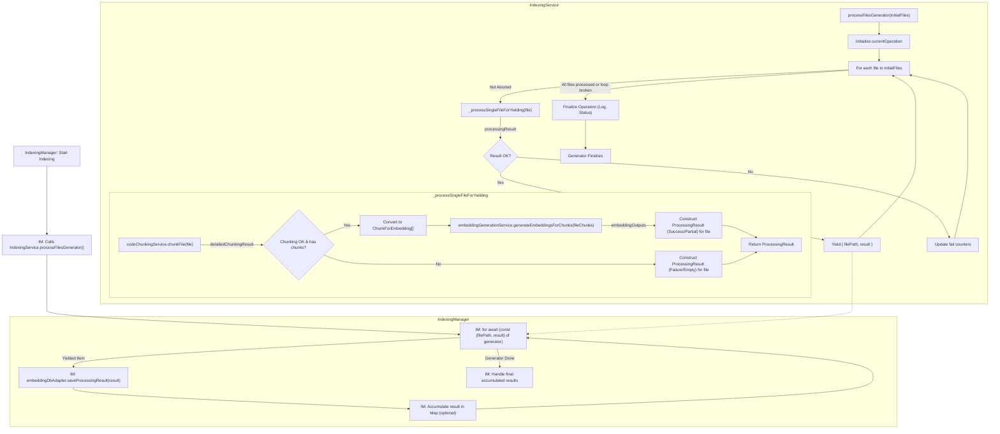

# IndexingService Refactoring Plan (Revised - Async Generator)

## 1. Introduction

This document outlines the revised plan to refactor the `IndexingService`. The primary goals are to:

1.  Ensure embeddings for each file are processed and made available for saving as soon as they are generated.
2.  Simplify `IndexingService` by making its main processing method an `async` generator, decoupling it from the saving mechanism.
3.  Simplify and stabilize the `progressCallback` mechanism.
4.  Maintain the modularity introduced by `CodeChunkingService` and `EmbeddingGenerationService`.
    This plan will change the public interface of `IndexingService.processFiles` to `processFilesGenerator` and alter how `IndexingManager` consumes its results.

## 2. New Services (Unchanged)

- **`CodeChunkingService`**: As previously defined.
- **`EmbeddingGenerationService`**: As previously defined.

## 3. Data Structures (Largely Unchanged)

- **`ChunkForEmbedding`**: As previously defined.
- **`EmbeddingGenerationOutput`**: As previously defined.
- **`ProcessingResult` (from `indexingTypes.ts`)**: Remains the key output per file.
- **`YieldedProcessingOutput`**:
  ```typescript
  interface YieldedProcessingOutput {
    filePath: string;
    result: ProcessingResult;
  }
  ```

## 4. Refactored `IndexingService` (Orchestrator) - Async Generator Flow

- **Dependencies**: Instantiates, initializes, and uses `CodeChunkingService` and `EmbeddingGenerationService`.
- **Initialization**: `IndexingService.initialize()` creates and initializes instances of the new services.
- **`public async *processFilesGenerator(initialFiles: FileToProcess[], embeddingOptions: EmbeddingOptions, progressCallback: ProgressCallbackType, abortController: AbortController): AsyncGenerator<YieldedProcessingOutput>` Method Flow**:
  1.  **Initial Setup**:
      - Initialize `currentOperation` (see section 6 for revised structure).
  2.  **Iterative File Processing (Loop through `op.initialFiles`)**:
      - For each `file` in `op.initialFiles`:
        a. **Abort Check**: If `op.abortController.signal.aborted`, break the loop. Log cancellation.
        b. Call a private helper method, e.g., `private async _processSingleFileForYielding(file: FileToProcess, operation: ProcessingOperation, embeddingOptions: EmbeddingOptions, progressCallback: ProgressCallbackType): Promise<ProcessingResult | null>`.
        i. Update `operation.filesAttemptedCount++`.
        ii. Report progress: `progressCallback(operation.filesAttemptedCount, operation.initialFiles.length, 'processing_file', { fileName: file.path, filePhase: 'starting' })`.
        iii. **Chunking**: - `detailedChunkingResult = await this.codeChunkingService.chunkFile(file, embeddingOptions, operation.abortController.signal)`. - If `operation.abortController.signal.aborted` after chunking, return `null` (or a specific error result). - Update `operation` chunking-related statistics. - Report progress: `progressCallback(operation.filesAttemptedCount, operation.initialFiles.length, 'processing_file', { fileName: file.path, filePhase: 'chunking_complete' })`.
        iv. **Embedding Generation (if chunking successful and produced chunks)**: - If `detailedChunkingResult` is valid and `detailedChunkingResult.chunks.length > 0`: - Convert `detailedChunkingResult.chunks` to `ChunkForEmbedding[]`. - `embeddingOutputs = await this.embeddingGenerationService.generateEmbeddingsForChunks(fileChunks, operation.abortController.signal)`. - If `operation.abortController.signal.aborted` after embedding, handle as cancelled. - Update `operation` embedding-related statistics. - Report progress: `progressCallback(operation.filesAttemptedCount, operation.initialFiles.length, 'processing_file', { fileName: file.path, filePhase: 'embedding_complete' })`. - Construct the final `ProcessingResult` for the file. - Else (chunking failed, was cancelled, or file yielded no chunks): - Construct an error or empty `ProcessingResult`. - Report progress.
        v. Return the constructed `ProcessingResult`.
        c. **Yielding Result**: - If the `processingResult` from the helper is not `null` (or indicates success): - `yield { filePath: file.path, result: processingResult };` - Update `operation.filesSuccessfullyYieldedCount++`. - Else (file processing failed or was skipped): - Update `operation.filesFailedProcessingCount++`.
  3.  **Finalization (after loop)**:
      - Update final status bar message based on `currentOperation` (e.g., completed, cancelled, errors).
      - Log final statistics.
      - The generator implicitly finishes.
- **Cancellation**: The `AbortController`'s signal is propagated and checked frequently.
- **Disposal**: `IndexingService.dispose()` calls `dispose()` on its services.

## 5. `IndexingManager` Adaptation

- `IndexingManager` will call `indexingService.processFilesGenerator(...)`.
- It will use a `for await (const { filePath, result } of generator)` loop to consume the yielded results.
- Inside the loop, for each `result`:
  - It will be responsible for saving the `ProcessingResult` (e.g., `await this.embeddingDbAdapter.saveProcessingResult(result)` or a similar method).
  - It can accumulate results into its own `Map<string, ProcessingResult>` if it needs the full collection at the end.
  - It handles abortion signals for breaking its own loop.

## 6. `progressCallback` Issues (Largely Unchanged from Previous Revision)

- **`IndexingService`'s `progressCallback` Signature**:
  `progressCallback(filesProcessedOverall: number, totalFilesToProcess: number, phase: 'processing_file' | 'finalizing', details?: { fileName?: string, filePhase?: 'starting' | 'chunking_complete' | 'embedding_complete' | 'failed_chunking' | 'failed_embedding', message?: string })`
  _(Note: 'batch_saved' phase is removed as `IndexingService` no longer manages batches for callbacks)._
- **`IndexingManager`'s `progressCallback` Implementation**: Remains as previously described, using `filesProcessedOverall` and `totalFilesToProcess`.

## 7. `currentOperation` Structure in `IndexingService` (Revised)

```typescript
interface ProcessingOperation {
  initialFiles: FileToProcess[];
  abortController: AbortController;

  // Overall Progress Counters
  filesAttemptedCount: number;
  filesSuccessfullyChunkedCount: number;
  filesEmbeddingsCompletedCount: number;
  filesSuccessfullyYieldedCount: number; // Renamed from filesSuccessfullyProcessedAndBatchedCount
  filesFailedProcessingCount: number;

  // Detailed Chunk/Embedding Level Counters
  totalChunksGeneratedCount: number;
  totalEmbeddingsAttemptedForChunks: number;
  totalEmbeddingsSucceededForChunks: number;

  // Status for current file (optional)
  currentFileProcessing?: string;
  currentFileStage?: "chunking" | "embedding" | "completed" | "failed";
}
```

## 8. Workflow Diagram (Async Generator)



## 9. Requirements Alignment (Revised)

1.  **Asynchronous Chunking**: `CodeChunkingService.chunkFile()` remains `async`.
2.  **Chunks to Embedding Mechanism**: Handled.
3.  **Chunk Dispatch**: Handled per file.
4.  **Individual Chunk Processing**: Handled by `EmbeddingGenerationService`.
5.  **Per-File Saving (Improved)**: `IndexingService` yields `ProcessingResult` per file. `IndexingManager` consumes and saves it immediately, achieving per-file persistence.
6.  **`progressCallback` Stability**: Simplified.

## 10. Test Plan Updates for `src/__tests__/indexingService.test.ts`

- **Adapt Existing Tests**:

  - The primary change will be how `processFilesGenerator` is called and how its results are consumed. Instead of expecting a `Promise<Map<string, ProcessingResult>>` and checking a `batchCompletedCallback` mock, tests will need to iterate over the async generator.
  - Example:

    ```typescript
    // Before
    // const results = await indexingService.processFiles(...);
    // expect(mockBatchCompletedCallback).toHaveBeenCalledWith(...);

    // After
    const yieldedResults = [];
    for await (const item of indexingService.processFilesGenerator(...)) {
        yieldedResults.push(item);
    }
    // Assertions on yieldedResults
    // expect(yieldedResults[0].result).toEqual(...);
    ```

- **Mocking Dependencies**:
  - `CodeChunkingService` and `EmbeddingGenerationService` will be the primary dependencies to mock for unit tests of `IndexingService`'s orchestration logic.
  - The note that `WorkerCodeChunker` (and by extension, `CodeChunkingService` if it's not mocked for _some_ integration-style tests within `indexingService.test.ts`) is not mocked in _current_ tests should be respected where applicable. If `indexingService.test.ts` has tests that are more integration-focused for the chunking part, those aspects can be maintained. For pure unit tests of `IndexingService`'s new generator logic, mocking `codeChunkingService.chunkFile` and `embeddingGenerationService.generateEmbeddingsForChunks` would be appropriate.
- **New Test Cases**:
  - Test successful iteration and yielding of multiple files.
  - Test behavior when `chunkFile` returns `null` or throws an error for a file (should it skip yielding or yield an error result?). The plan suggests yielding an error result or skipping. This needs to be consistent.
  - Test behavior when `generateEmbeddingsForChunks` returns errors for some chunks or all chunks of a file.
  - Test abortion scenarios: how the generator terminates and what `IndexingManager` observes.
  - Test `progressCallback` invocations at various stages.
  - Test edge cases: no files to process, empty files, files that produce no chunks.
- **`IndexingManager` Tests**: Tests for `IndexingManager` will also need to be updated or added to verify it correctly consumes the generator and calls the database adapter.

## 11. Documentation Updates Required

- **Section 1.2.3 (Indexing Workflow)**:
  - Revise to show `IndexingService` yielding results per file, and `IndexingManager` consuming and saving them.
- **Section 2.2.1 (Indexing Service - `src/services/indexingService.ts`)**:
  - Change `processFiles` to `processFilesGenerator`. Describe its new signature and `AsyncGenerator` return type.
  - Remove `batchCompletedCallback` from its description.
  - Explain that it yields `ProcessingResult` for each file.
- **Section 2.2.2 (Indexing Manager - `src/services/indexingManager.ts`)**:
  - Clarify how `IndexingManager` calls `processFilesGenerator` and uses `for await...of` to consume results.
  - Detail its responsibility for saving each result via `EmbeddingDatabaseAdapter`.
  - Update the description of the `progressCallback` it provides.
- **Section 3.1 (Embedding Generation Algorithm)**:
  - Step 5 (Result Processing): Emphasize that `IndexingService` yields results, and `IndexingManager` handles persistence.

This revised plan incorporating the async generator pattern should lead to a more robust, decoupled, and maintainable indexing process.
