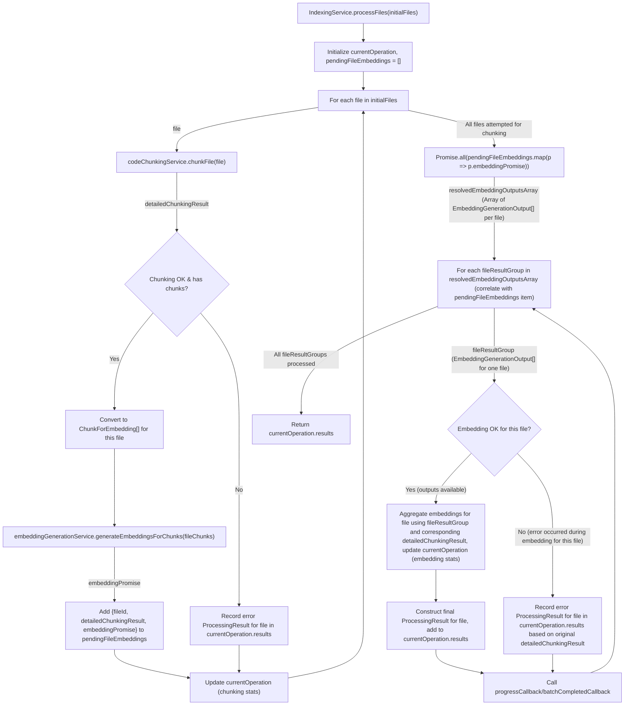

# IndexingService Refactoring Plan

## 1. Introduction

This document outlines the plan to refactor the `IndexingService` to reduce its complexity, improve modularity, and enhance maintainability. The core idea is to delegate distinct responsibilities of code chunking and embedding generation to new, focused services, with `IndexingService` acting as an orchestrator. This plan preserves the public interface of `IndexingService`.

## 2. New Services

Two new services will be introduced:

### 2.1. `CodeChunkingService`

- **Responsibility**: Handles all aspects of reading files and breaking them down into structured code chunks. It encapsulates the logic currently in `IndexingService` related to `WorkerCodeChunker` (which uses `TreeStructureAnalyzer` and `WorkerTokenEstimator`).
- **Instantiation**: Instantiated and managed by `IndexingService`.
- **Key Public Methods**:
  - `constructor(options: CodeChunkingServiceOptions)`
  - `async initialize(): Promise<void>`: Sets up internal components.
  - `async chunkFile(file: FileToProcess, embeddingOptions: EmbeddingOptions, abortSignal: AbortSignal): Promise<DetailedChunkingResult | null>`: Asynchronously processes a single file on the main thread, returning its chunks or null if an error occurs or no chunks are generated.
  - `dispose(): void`

### 2.2. `EmbeddingGenerationService`

- **Responsibility**: Manages the `Tinypool` worker pool for `embeddingGeneratorWorker.ts` and generates embeddings for a given collection of code chunks. Each chunk is processed as an individual task by a worker.
- **Instantiation**: Instantiated and managed by `IndexingService`.
- **Key Public Methods**:
  - `constructor(options: EmbeddingGenerationServiceOptions)`
  - `async initialize(): Promise<void>`: Initializes the `Tinypool`.
  - `async generateEmbeddingsForChunks(chunksToEmbed: ChunkForEmbedding[], abortSignal: AbortSignal): Promise<EmbeddingGenerationOutput[]>`: Takes an array of `ChunkForEmbedding` objects and returns an array of results, each linking an embedding (or error) back to the original chunk information.
  - `dispose(): Promise<void>`

## 3. Data Structures

- **`ChunkForEmbedding`**:
  - `fileId: string`
  - `filePath: string`
  - `chunkIndexInFile: number`
  - `text: string`
  - `offsetInFile: number`
- **`EmbeddingGenerationOutput`**:
  - `originalChunkInfo: ChunkForEmbedding`
  - `embedding: Float32Array | null`
  - `error?: string`

## 4. Refactored `IndexingService` (Orchestrator)

- **Dependencies**: Instantiates, initializes, and uses `CodeChunkingService` and `EmbeddingGenerationService`.
- **Initialization**: The `IndexingService` constructor will create and `await initialize()` instances of the new services. `IndexingServiceOptions` will be adapted to provide necessary sub-options to these services.
- **`processFiles()` Method Flow**:
  1.  **Initial Setup**:
      - Initialize `currentOperation` (see section 5 for structure).
      - Create a list `pendingFileEmbeddings` to store objects like `{ fileId: string, detailedChunkingResult: DetailedChunkingResult, embeddingPromise: Promise<EmbeddingGenerationOutput[]> }`.
  2.  **Phase 1: Per-File Chunking & Embedding Dispatch (Loop through `initialFiles`)**:
      - For each `file`:
        - `detailedChunkingResult = await this.codeChunkingService.chunkFile(file, embeddingOptions, abortController.signal)`.
        - Update `currentOperation` chunking-related statistics.
        - If `detailedChunkingResult` is valid and contains chunks:
          - Convert these chunks to `ChunkForEmbedding[]` for the current file.
          - `embeddingPromise = this.embeddingGenerationService.generateEmbeddingsForChunks(fileChunks, abortController.signal)`.
          - Add `{ fileId: file.id, detailedChunkingResult, embeddingPromise }` to `pendingFileEmbeddings`.
        - Else (chunking failed or file yielded no chunks):
          - Record an error `ProcessingResult` for this `file.id` directly into `currentOperation.results`.
          - Update progress callbacks and status bar for the chunking phase.
  3.  **Phase 2: Await All Embedding Promises**:
      - `const allEmbeddingPromises = pendingFileEmbeddings.map(p => p.embeddingPromise);`
      - `const resolvedEmbeddingOutputsArray = await Promise.all(allEmbeddingPromises);`
      - This `resolvedEmbeddingOutputsArray` will be an array where each element is an `EmbeddingGenerationOutput[]` corresponding to a file.
  4.  **Phase 3: Result Aggregation (Loop through `resolvedEmbeddingOutputsArray`)**:
      - For each `embeddingOutputsForFile` (an `EmbeddingGenerationOutput[]`) in `resolvedEmbeddingOutputsArray`:
        - Correlate it back to its original `fileId` and `detailedChunkingResult` using the `pendingFileEmbeddings` list (by index).
        - Aggregate all embeddings for the current file from `embeddingOutputsForFile`.
        - Update `currentOperation` embedding-related statistics.
        - Construct the final `ProcessingResult` for the file (using `detailedChunkingResult` for offsets/metadata and the collected embeddings).
        - Store this `ProcessingResult` in `currentOperation.results`.
        - Call `progressCallback` and `batchCompletedCallback` as appropriate.
  5.  **Return**: Return `currentOperation.results`.
- **Cancellation**: The `AbortController`'s signal from `IndexingService` is propagated to both new services.
- **Disposal**: `IndexingService.dispose()` calls `dispose()` on its `CodeChunkingService` and `EmbeddingGenerationService` instances.

## 5. `currentOperation` Structure in `IndexingService`

To track multi-stage progress:

```typescript
interface ProcessingOperation {
  initialFiles: FileToProcess[];
  abortController: AbortController;
  results: Map<string, ProcessingResult>; // Final or error results per fileId

  // Chunking Phase
  filesChunkingAttemptedCount: number;
  filesSuccessfullyChunkedCount: number; // Files that yielded chunks
  totalChunksGeneratedCount: number; // Total individual code chunks from all files

  // Embedding Phase
  embeddingsProcessedCount: number; // Individual chunk embeddings processed (success or failure)
  filesEmbeddingsCompletedCount: number; // Files with ALL their chunks' embeddings processed
}
```

## 6. Workflow Diagram (Per-File Dispatch and Final Aggregation)



## 7. Requirements Alignment

This plan meets the specified requirements:

1.  **Asynchronous Chunking**: `CodeChunkingService.chunkFile()` is `async`.
2.  **Chunks to Embedding Mechanism**: Chunks from `CodeChunkingService` are passed to `EmbeddingGenerationService`.
3.  **Chunk Dispatch (3b)**: All chunks for a single file are collected, and then these chunks are dispatched together for embedding generation for that file. This is repeated for all files, and `IndexingService` then awaits all these embedding operations.
4.  **Individual Chunk Processing by Embedding Mechanism**: `EmbeddingGenerationService` submits each chunk as an individual task to `Tinypool`, which manages concurrent execution by workers that process one chunk per task.
5.  **Per-File Saving**: Embedding results for an entire file are aggregated by `IndexingService` before the final `ProcessingResult` for that file is constructed and made available for saving (e.g., via `batchCompletedCallback` to `EmbeddingDatabaseAdapter`).

This approach simplifies `IndexingService`, enhances modularity, and maintains clear responsibilities.
